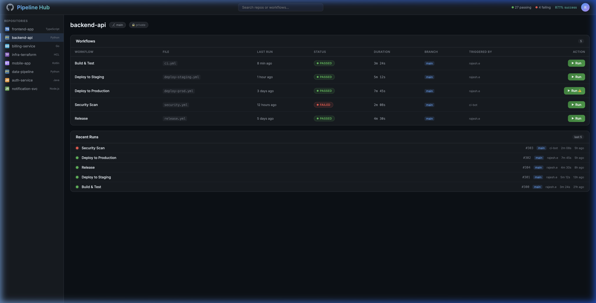

# Pipeline Hub — GitHub Workflow Dashboard

A unified dashboard to view and trigger GitHub Actions workflows across all your repos from a single UI.



## Features

- **All repos in one place** — no more repo-hopping to check builds
- **One-click workflow trigger** — run any workflow with or without input parameters
- **Live status** — auto-refreshes every 5 seconds
- **Input parameter support** — prompts for `workflow_dispatch` inputs (dropdowns, text) before running
- **Recent runs timeline** — see pass/fail history at a glance
- **Search** — filter repos by name or language
- **Mock mode** — works without a token for demo/testing

---

## Quick Start (Local)

### 1. Install dependencies

```bash
cd pipeline_hub
pip install -r requirements.txt
```

### 2. Create a GitHub Personal Access Token

1. Go to [GitHub → Settings → Developer settings → Personal access tokens → Fine-grained tokens](https://github.com/settings/tokens?type=beta)
2. Click **Generate new token**
3. Configure:
   - **Token name**: `pipeline-hub`
   - **Expiration**: 90 days (or custom)
   - **Repository access**: Select the repos you want
   - **Permissions**:
     - **Actions**: Read and write (to trigger workflows)
     - **Contents**: Read-only (to parse workflow files for inputs)
     - **Metadata**: Read-only (required)
4. Click **Generate token** and copy the token

> **Classic tokens also work** — use scopes: `repo`, `workflow`

### 3. Run locally

```bash
# Option A: Specific repos
export GITHUB_TOKEN=ghp_your_token_here
export GITHUB_REPOS="my-org/frontend-app,my-org/backend-api,my-org/billing-service"
python app.py

# Option B: All repos from an org
export GITHUB_TOKEN=ghp_your_token_here
export GITHUB_ORG=my-org
python app.py

# Option C: All repos accessible by token
export GITHUB_TOKEN=ghp_your_token_here
python app.py

# Option D: Mock mode (no token needed)
python app.py
```

Open [http://localhost:9090](http://localhost:9090)

---

## Deploy to Kubernetes

### Step 1: Build and push the Docker image

```bash
# Build
docker build -t YOUR_REGISTRY/pipeline-hub:v1.0 .

# Push to your registry
docker push YOUR_REGISTRY/pipeline-hub:v1.0
```

### Step 2: Create the GitHub token secret

```bash
kubectl create secret generic pipeline-hub-github \
  --from-literal=GITHUB_TOKEN=ghp_your_token_here \
  -n YOUR_NAMESPACE
```

### Step 3: Update the manifest

Edit `manifests/deploy.yaml`:
- Replace `YOUR_REGISTRY/pipeline-hub:latest` with your image
- Replace `YOUR_GITHUB_ORG` with your GitHub org
- Optionally use `GITHUB_REPOS` instead for specific repos

### Step 4: Deploy

```bash
kubectl apply -f manifests/deploy.yaml -n YOUR_NAMESPACE
```

### Step 5: Access the dashboard

```bash
# Port forward to access locally
kubectl port-forward svc/pipeline-hub 9090:9090 -n YOUR_NAMESPACE

# Open http://localhost:9090
```

Or set up an Ingress/VirtualService for permanent access.

---

## Environment Variables

| Variable | Required | Default | Description |
|---|---|---|---|
| `GITHUB_TOKEN` | Yes* | — | GitHub PAT with `repo` + `workflow` scopes. *Not required for mock mode. |
| `GITHUB_ORG` | No | auto | GitHub org to list repos from. If empty, lists repos from the token owner. |
| `GITHUB_REPOS` | No | — | Comma-separated list of specific repos (e.g. `org/repo1,org/repo2`). Overrides org listing. |
| `PIPELINE_HUB_PORT` | No | `9090` | Port to run on. |
| `MOCK_MODE` | No | `false` | Force mock mode even if token is set. |

---

## Workflow Requirements

For workflows to be triggerable from Pipeline Hub, they need the `workflow_dispatch` event:

```yaml
# .github/workflows/deploy.yml
name: Deploy to Staging

on:
  workflow_dispatch:          # ← Required for manual/API triggering
    inputs:                   # Optional: define input parameters
      environment:
        description: 'Target environment'
        required: true
        default: 'staging'
        type: choice
        options:
          - staging
          - production
      tag:
        description: 'Docker image tag'
        required: false
        type: string
  push:
    branches: [main]          # Can still auto-trigger on push

jobs:
  deploy:
    runs-on: ubuntu-latest
    steps:
      - uses: actions/checkout@v4
      - run: echo "Deploying ${{ inputs.environment }} with tag ${{ inputs.tag }}"
```

Workflows without `workflow_dispatch` will still show in the dashboard with their status, but the "Run" button won't work.

---

## Project Structure

```
pipeline_hub/
├── app.py              # Flask app with GitHub API integration + mock fallback
├── requirements.txt    # Python dependencies
├── Dockerfile          # Container image
├── manifests/
│   └── deploy.yaml     # Kubernetes Deployment + Service
├── templates/
│   └── index.html      # Single-page frontend
└── README.md           # This file
```

---

## GitHub API Rate Limits

- **Authenticated**: 5,000 requests/hour
- Pipeline Hub makes ~(1 + N) API calls per repo view (1 for workflows list + N for each workflow's last run)
- With 10 repos × 5 workflows each = ~60 calls per full page load
- Auto-refresh every 5s = ~720 calls/min (too high for many repos!)

**Recommended**: If you have many repos, use `GITHUB_REPOS` to list only the repos you care about, or increase the refresh interval.

---

## Security Notes

- The GitHub token is stored as a Kubernetes Secret, never hardcoded
- The app only needs `Actions: Read+Write` and `Contents: Read` permissions
- No data is persisted — everything is fetched live from GitHub
- Token is never exposed to the frontend
